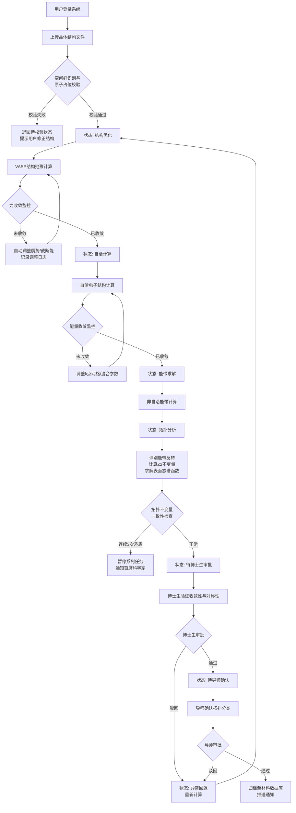
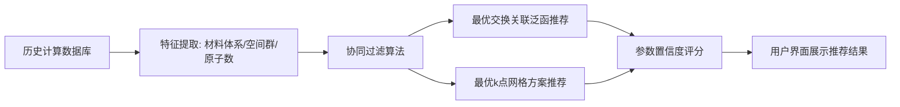

## 1. 产品概述

面向拓扑材料电子结构的高通量自动计算与对称性分析平台，致力于为凝聚态物理研究团队提供一站式的材料计算、拓扑分析、数据管理与协同审批解决方案。通过自动化流程管理与智能推荐引擎，大幅降低拓扑材料筛选的时间成本与计算门槛，加速新型量子材料的发现进程。

## 2. 核心功能

### 2.1 用户角色

| 角色 | 注册方式 | 核心权限 |
|------|----------|----------|
| 博士生 | 课题组导师邀请 | 创建计算任务、上传晶体结构、验证收敛性与对称性、查看个人任务列表 |
| 导师 | 首席科学家邀请 | 审批拓扑分类结果、查看全组任务、管理课题组成员 |
| 首席科学家 | 平台管理员创建 | 管理多个课题组、接收异常通知、查看全局统计数据、配置系统参数 |
| 管理员 | 系统初始账户 | 用户管理、系统配置、数据库维护、日志审计 |

### 2.2 功能模块

1. **登录认证页**：角色选择登录、权限验证、会话管理
2. **任务管理看板**：任务列表、状态流转监控、任务详情查看、新任务创建
3. **结构上传与校验**：CIF/POSCAR文件上传、空间群识别、原子占位合理性校验
4. **实时计算监控**：能量收敛曲线、应力张量监控、参数自动调整日志
5. **拓扑分析结果**：能带结构投影图、态密度曲线、能带反转识别、Z2不变量计算、表面态谱函数
6. **两级审批流程**：博士生验证、导师确认拓扑分类、审批历史记录
7. **智能推荐引擎**：最优交换关联泛函推荐、k点网格方案推荐
8. **报告与导出**：综合PDF报告生成、按条件导出电子结构与拓扑数据
9. **异常通知系统**：拓扑不变量矛盾检测、任务暂停机制、消息推送
10. **统计综合看板**：计算完成率、平均自洽迭代次数、拓扑分类准确度、性能趋势图
11. **材料数据库**：已归档材料浏览、按材料体系/空间群/带隙类型检索
12. **系统设置页**：个人信息、权限配置、计算参数模板管理

### 2.3 页面详情

| 页面名称 | 模块名称 | 功能描述 |
|----------|----------|----------|
| 登录页 | 角色登录模块 | 用户名密码登录、角色切换、记住登录状态、忘记密码 |
| 任务管理看板 | 任务列表模块 | 按状态筛选任务、搜索任务、批量操作、任务卡片展示状态进度 |
| 任务管理看板 | 任务创建模块 | 晶体文件上传、计算参数配置、智能推荐参数应用、提交任务 |
| 任务详情页 | 结构信息模块 | 显示空间群、晶胞参数、原子坐标、占位校验结果 |
| 任务详情页 | 计算监控模块 | 实时能量/力收敛曲线图、应力张量矩阵、超软赝势/截断能调整日志 |
| 任务详情页 | 拓扑分析模块 | 能带结构图（高亮反转区域）、态密度图、Z2拓扑不变量数值、表面态色散图 |
| 任务详情页 | 审批模块 | 收敛性验证表单、拓扑分类确认、审批意见填写、审批状态流转 |
| 报告导出页 | 报告预览模块 | PDF在线预览、包含能带/态密度/拓扑分类/表面态的综合报告 |
| 报告导出页 | 数据导出模块 | 按材料体系/空间群/带隙类型筛选、导出CSV/JSON格式数据 |
| 统计看板 | 指标概览模块 | 今日完成率、平均自洽迭代数、拓扑分类准确度、异常任务数 |
| 统计看板 | 趋势图模块 | 近30天计算量趋势、各状态任务分布饼图、各课题组对比图 |
| 材料数据库 | 检索模块 | 多条件组合检索、结果列表展示、详情页跳转 |
| 消息中心 | 通知列表模块 | 异常通知、审批通知、任务完成通知、已读/未读状态管理 |
| 系统设置 | 用户管理模块 | 成员列表、角色分配、邀请新成员、账户状态管理 |
| 系统设置 | 参数模板模块 | 交换关联泛函配置、k点方案配置、自定义计算模板保存 |

## 3. 核心流程

### 3.1 计算任务主流程

用户上传CIF/POSCRY文件后，系统自动执行空间群识别与原子占位校验，通过后任务进入"结构优化"阶段。在计算过程中，系统实时监控能量收敛和应力张量，当未达到力收敛阈值时自动调整超软赝势或平面波截断能并记录调整日志。能带计算完成后自动识别费米面附近能带反转、计算Z2拓扑不变量与表面态谱函数。计算完成后进入两级审批：博士生验证收敛性与对称性，导师确认拓扑分类，通过后自动归档至材料数据库。当同一材料系列连续三次计算的拓扑不变量出现矛盾时，自动暂停该系列新任务并通知首席科学家。

### 3.2 智能推荐引擎流程

## 4. 用户界面设计

### 4.1 设计风格

- **主色调**：深空蓝 (#0F172A) 作为主背景色，搭配晶体青色 (#22D3EE) 作为主强调色，拓扑紫 (#A855F7) 作为次要强调色
- **辅助色**：成功绿 (#10B981)、警告橙 (#F59E0B)、异常红 (#EF4444)、信息蓝 (#3B82F6)
- **按钮风格**：圆角6px，主按钮使用渐变背景（晶体青到拓扑紫），悬停时有发光效果
- **字体选择**：标题使用 JetBrains Mono（科技感等宽字体），正文使用 Noto Sans SC（清晰中文显示）
- **布局风格**：深色仪表盘风格，左侧导航栏固定，右侧卡片式内容区，数据可视化图表使用科学计算风格
- **图标风格**：使用 Lucide 线性图标，结合晶格/轨道/能带等物理符号装饰

### 4.2 页面设计概述

| 页面名称 | 模块名称 | UI元素 |
|----------|----------|--------|
| 登录页 | 登录表单 | 深空背景 + 晶体粒子动画，居中登录卡片，角色选择标签页，渐变登录按钮 |
| 任务看板 | 任务列表 | 顶部筛选栏（状态/时间/关键词），瀑布流任务卡片（显示进度条与状态徽标），悬浮创建按钮 |
| 任务看板 | 创建弹窗 | 拖拽上传区（CIF/POSCAR图标），参数配置面板（推荐参数高亮），确认提交按钮 |
| 任务详情页 | 结构信息 | 三维晶胞预览区（可旋转），空间群信息卡片，原子列表表格 |
| 任务详情页 | 收敛监控 | 双Y轴折线图（能量/力收敛），应力张量3x3矩阵热力图，参数调整日志时间轴 |
| 任务详情页 | 拓扑分析 | 能带结构图（费米面高亮红色虚线，反转区域紫色阴影），态密度曲线图，Z2数值卡片，表面态色散热图 |
| 任务详情页 | 审批区 | 左右双栏对比（博士生意见/导师意见），审批表单，审批历史时间线 |
| 统计看板 | 数据指标 | 4个核心指标大卡片（带趋势箭头），下方三栏趋势图（折线/饼图/柱状） |
| 材料数据库 | 检索列表 | 顶部多条件筛选器，卡片式材料列表（显示分子式/空间群/带隙/拓扑分类标签） |

### 4.3 响应式设计

- 桌面端优先：1440px及以上为主要设计分辨率，适配1920px大屏显示
- 平板适配：1024px时折叠左侧导航为图标模式，图表区域自适应宽度
- 移动端：768px以下采用单列布局，图表支持全屏查看，简化表格为卡片列表
- 所有图表使用响应式容器，数据表格支持横向滚动

### 4.4 数据可视化指导

- **能带结构图**：横轴为高对称k点路径（Γ-X-M-Γ等），纵轴为能量（单位eV），费米面处红色虚线，不同轨道投影用颜色映射
- **态密度图**：左侧分波态密度（s/p/d轨道分色），右侧总态密度，费米面垂直虚线
- **收敛曲线**：能量收敛用蓝色实线（左Y轴对数刻度），力收敛用橙色虚线（右Y轴），收敛阈值水平参考线
- **表面态谱函数**：二维热图，横轴k点路径，纵轴能量，颜色表示谱函数权重（蓝→白→红渐变）
- **Z2不变量展示**：使用拓扑相图风格的卡片，显示Z2=(ν₀;ν₁ν₂ν₃)，用不同颜色边框表示拓扑分类（平庸/强拓扑/弱拓扑）
