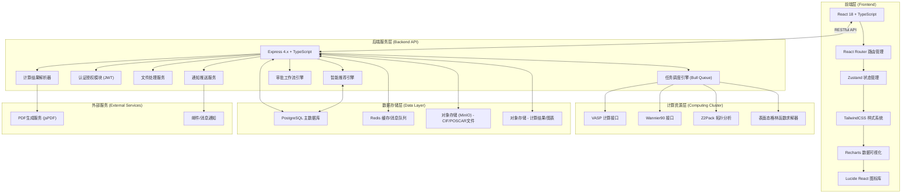
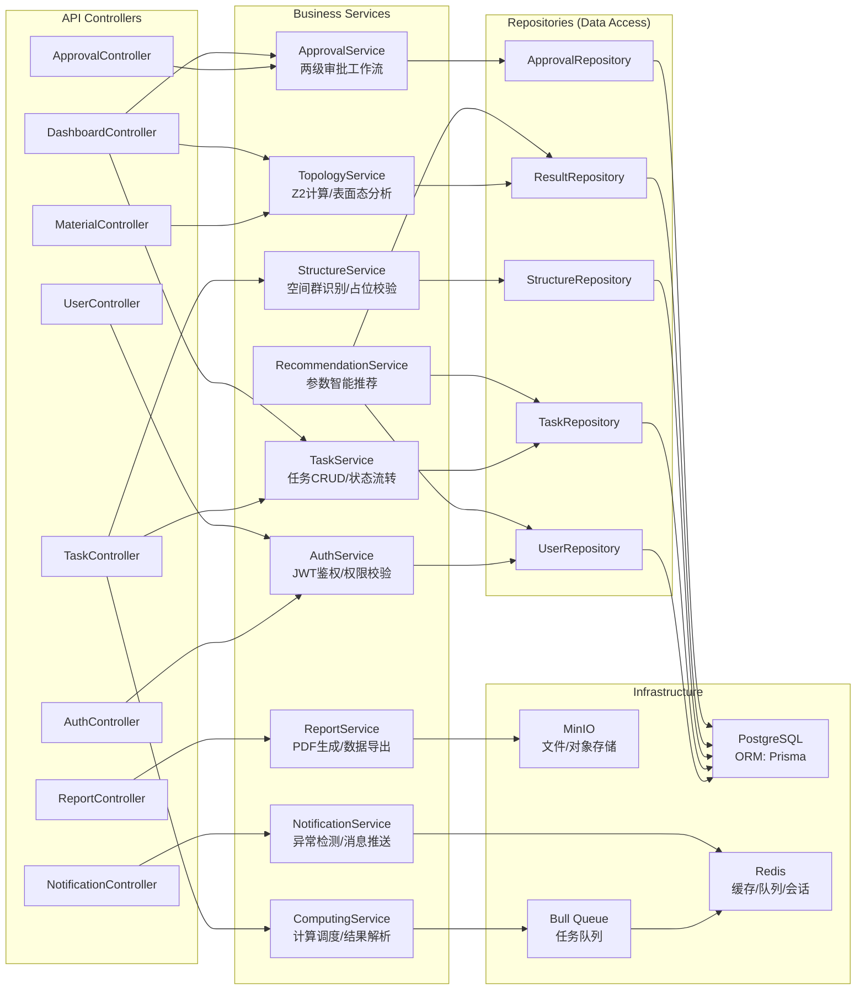

## 1. 架构设计



## 2. 技术描述

- **前端框架**: React@18 + TypeScript + Vite@6
- **状态管理**: Zustand@4 (轻量级状态管理，适合中后台复杂交互)
- **路由管理**: React Router DOM@6
- **样式方案**: TailwindCSS@3 + CSS变量主题系统
- **数据可视化**: Recharts@2 (能带图/态密度/收敛曲线) + 自定义Canvas组件 (表面态热图)
- **UI组件**: 自研深色科技风格组件库，基于Radix Primitives
- **HTTP客户端**: Axios + React Query (缓存与状态同步)
- **初始化工具**: vite-init (react-express-ts模板)
- **后端框架**: Express@4.x + TypeScript (ESM模式)
- **任务调度**: Bull (基于Redis的任务队列，支持重试/优先级/延迟)
- **认证方案**: JWT (Access Token + Refresh Token) + 角色权限控制(RBAC)
- **数据库**: PostgreSQL 15 (主数据) + Redis 7 (缓存/会话/队列)
- **文件存储**: MinIO (S3兼容对象存储)
- **PDF生成**: jsPDF + html2canvas (前端预览) + Puppeteer (服务端高质量PDF)
- **Mock数据**: 内置完整的Mock数据层，无需真实计算集群即可演示全流程

## 3. 路由定义

| 路由路径 | 页面名称 | 权限要求 | 说明 |
|----------|----------|----------|------|
| /login | 登录页 | 公开 | 角色选择登录 |
| /dashboard | 统计看板 | 所有已登录用户 | 综合数据统计与趋势图 |
| /tasks | 任务管理看板 | 所有已登录用户 | 任务列表、筛选、创建新任务 |
| /tasks/:id | 任务详情页 | 任务创建者/审批人/管理员 | 结构信息、计算监控、拓扑分析、审批 |
| /materials | 材料数据库 | 所有已登录用户 | 已归档材料检索与浏览 |
| /materials/:id | 材料详情页 | 所有已登录用户 | 材料完整电子结构与拓扑数据 |
| /reports | 报告与导出 | 所有已登录用户 | PDF报告预览、数据导出 |
| /approvals | 审批中心 | 博士生/导师/首席科学家 | 待审批任务列表与批量处理 |
| /notifications | 消息中心 | 所有已登录用户 | 通知列表与已读管理 |
| /settings/profile | 个人设置 | 所有已登录用户 | 个人信息、密码修改 |
| /settings/users | 用户管理 | 导师/首席科学家/管理员 | 成员管理、角色分配 |
| /settings/templates | 参数模板 | 首席科学家/管理员 | 计算参数模板配置 |
| /settings/system | 系统配置 | 管理员 | 全局系统参数配置 |

## 4. API定义 (TypeScript类型)

```typescript
// 用户相关类型
type UserRole = 'phd_student' | 'supervisor' | 'chief_scientist' | 'admin';

interface User {
  id: string;
  username: string;
  email: string;
  realName: string;
  role: UserRole;
  groupId?: string;
  avatar?: string;
  createdAt: string;
  lastLoginAt: string;
}

// 任务相关类型
type TaskStatus = 
  | 'pending_validation'
  | 'structure_optimization'
  | 'scf_calculation'
  | 'band_calculation'
  | 'topology_analysis'
  | 'pending_phd_approval'
  | 'pending_supervisor_approval'
  | 'completed'
  | 'error_fallback'
  | 'paused';

interface CrystalStructure {
  formula: string;
  spaceGroup: string;
  spaceGroupNumber: number;
  latticeParams: { a: number; b: number; c: number; alpha: number; beta: number; gamma: number };
  atoms: Array<{ element: string; wyckoff: string; x: number; y: number; z: number; occupancy: number }>;
  validationResult: { valid: boolean; issues: string[] };
}

interface CalculationParams {
  functional: string;          // 交换关联泛函: PBE, PBE+U, HSE06, meta-GGA
  kpointMesh: [number, number, number];
  cutoffEnergy: number;        // 平面波截断能 (eV)
  pseudopotential: string;     // 超软赝势类型
  forceThreshold: number;      // 力收敛阈值 (eV/Å)
  energyThreshold: number;     // 能量收敛阈值 (eV)
  spinPolarized: boolean;
  socEnabled: boolean;         // 自旋轨道耦合
}

interface ConvergenceLog {
  step: number;
  energy: number;
  maxForce: number;
  stressTensor: number[][];
  timestamp: string;
  paramAdjustment?: { type: 'cutoff' | 'pseudopotential' | 'kpoints'; from: any; to: any; reason: string };
}

interface TopologyResult {
  bandInversion: { detected: boolean; kpoints: string[]; energyRange: [number, number] };
  z2Invariant: { nu0: 0 | 1; nu1: 0 | 1; nu2: 0 | 1; nu3: 0 | 1 };
  topologyClass: 'trivial' | 'weak_topological' | 'strong_topological' | 'crystalline_topological';
  surfaceStates: { kpath: string[]; energies: number[]; spectralWeight: number[][] };
  bandGap: { value: number; type: 'direct' | 'indirect' };
  fermiLevel: number;
}

interface ApprovalRecord {
  id: string;
  taskId: string;
  approverId: string;
  approverName: string;
  approvalType: 'phd_validation' | 'supervisor_confirmation';
  decision: 'approved' | 'rejected';
  comments: string;
  convergenceVerified?: boolean;
  symmetryVerified?: boolean;
  topologyConfirmed?: boolean;
  createdAt: string;
}

interface ComputationTask {
  id: string;
  title: string;
  creatorId: string;
  creatorName: string;
  groupId: string;
  status: TaskStatus;
  progress: number;
  structure: CrystalStructure;
  params: CalculationParams;
  recommendedParams?: Partial<CalculationParams> & { confidence: number };
  convergenceLogs: ConvergenceLog[];
  topologyResult?: TopologyResult;
  approvalRecords: ApprovalRecord[];
  materialSeriesId?: string;
  createdAt: string;
  startedAt?: string;
  completedAt?: string;
  errorMessage?: string;
}

// API请求/响应类型
interface ApiResponse<T> {
  code: number;
  message: string;
  data: T;
}

interface LoginRequest { username: string; password: string; role: UserRole }
interface LoginResponse { accessToken: string; refreshToken: string; user: User }
interface TaskListRequest { page: number; pageSize: number; status?: TaskStatus[]; keyword?: string; groupId?: string }
interface TaskListResponse { items: ComputationTask[]; total: number; page: number; pageSize: number }
interface MaterialSearchRequest { formula?: string; spaceGroup?: number; topologyClass?: string; bandGapMin?: number; bandGapMax?: number }
interface DashboardStats { completionRate: number; avgScfIterations: number; topologyAccuracy: number; abnormalTasks: number; trends: { dates: string[]; values: number[] } }

// 通知类型
type NotificationType = 'task_completed' | 'approval_requested' | 'topology_conflict' | 'system_alert';
interface Notification { id: string; type: NotificationType; title: string; content: string; read: boolean; relatedTaskId?: string; createdAt: string }
```

## 5. 后端服务架构



## 6. 数据模型

### 6.1 实体关系图 (ER Diagram)

```mermaid
erDiagram
    RESEARCH_GROUP ||--o{ USER : "包含"
    USER ||--o{ COMPUTATION_TASK : "创建"
    USER ||--o{ APPROVAL_RECORD : "审批"
    COMPUTATION_TASK ||--|| CRYSTAL_STRUCTURE : "关联"
    COMPUTATION_TASK ||--o{ CONVERGENCE_LOG : "包含"
    COMPUTATION_TASK ||--o| TOPOLOGY_RESULT : "产出"
    COMPUTATION_TASK ||--o{ APPROVAL_RECORD : "经历"
    COMPUTATION_TASK ||--o| CALCULATION_PARAMS : "使用"
    COMPUTATION_TASK }o--|| MATERIAL_SERIES : "属于"
    MATERIAL_SERIES ||--o{ TOPOLOGY_CONFLICT : "产生"
    TOPOLOGY_RESULT ||--o{ MATERIAL_ARCHIVE : "归档为"
    RECOMMENDATION_TEMPLATE ||--o{ CALCULATION_PARAMS : "应用于"
    USER ||--o{ NOTIFICATION : "接收"

    USER {
        uuid id PK
        string username UK
        string email UK
        string real_name
        string password_hash
        enum role
        uuid group_id FK
        string avatar_url
        datetime created_at
        datetime last_login_at
    }

    RESEARCH_GROUP {
        uuid id PK
        string name
        uuid supervisor_id FK
        text description
        datetime created_at
    }

    COMPUTATION_TASK {
        uuid id PK
        string title
        uuid creator_id FK
        uuid group_id FK
        uuid series_id FK
        enum status
        integer progress
        json params
        datetime created_at
        datetime started_at
        datetime completed_at
        text error_message
    }

    CRYSTAL_STRUCTURE {
        uuid id PK
        uuid task_id FK UK
        string formula
        string space_group
        integer space_group_number
        json lattice_parameters
        json atom_sites
        json validation_result
        string cif_file_url
    }

    CONVERGENCE_LOG {
        uuid id PK
        uuid task_id FK
        integer step_number
        float total_energy
        float max_force
        json stress_tensor
        json param_adjustment
        datetime timestamp
    }

    TOPOLOGY_RESULT {
        uuid id PK
        uuid task_id FK UK
        json band_inversion
        json z2_invariant
        enum topology_class
        float band_gap_value
        enum band_gap_type
        float fermi_level
        json band_structure_data
        json dos_data
        json surface_states_data
    }

    APPROVAL_RECORD {
        uuid id PK
        uuid task_id FK
        uuid approver_id FK
        enum approval_type
        enum decision
        text comments
        boolean convergence_verified
        boolean symmetry_verified
        boolean topology_confirmed
        datetime created_at
    }

    MATERIAL_SERIES {
        uuid id PK
        string name
        string base_formula
        boolean is_paused
        text pause_reason
        datetime created_at
    }

    MATERIAL_ARCHIVE {
        uuid id PK
        uuid topology_result_id FK UK
        string formula
        string space_group
        enum topology_class
        float band_gap
        json search_tags
        datetime archived_at
    }

    RECOMMENDATION_TEMPLATE {
        uuid id PK
        string name
        json functional_options
        json kpoint_options
        json usage_stats
        uuid created_by FK
        datetime created_at
    }

    NOTIFICATION {
        uuid id PK
        uuid user_id FK
        enum type
        string title
        text content
        boolean is_read
        uuid related_task_id FK
        datetime created_at
    }
```

### 6.2 数据初始化 (Mock Data)

系统内置以下Mock数据用于完整功能演示：
- 4个测试用户（每种角色1个），2个研究组
- 25个示例计算任务，覆盖所有状态（待校验/各计算阶段/各审批阶段/已完成/异常）
- 15个已归档材料记录，包含真实拓扑材料示例（Bi₂Se₃、Bi₂Te₃、Na₃Bi、Cd₃As₂等）
- 完整的收敛日志数据（能量/力收敛曲线、参数调整记录）
- 预计算的能带/态密度/表面态数据（Bi₂Se₃作为标准样例）
- 智能推荐引擎训练数据（100条历史计算记录统计）
- 审批记录与通知消息示例
